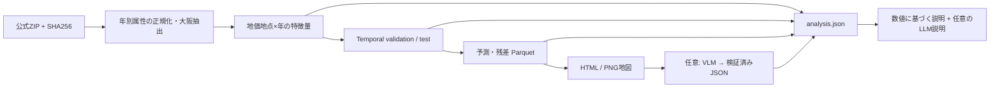

# Osaka Geospatial AI

[](https://colab.research.google.com/github/Mr-Kondo/osaka-geospatial-ai/blob/main/notebooks/colab_demo.ipynb)

## Project Overview

大阪府の公的GISデータを取得し、地価地点ごとの特徴量、翌年の地価変化率予測、地図、構造化JSON、日本語レポートを生成するPoCです。標準設定は**2019〜2025年の実データ**を使用します。合成データによる代替は行いません。

**標準の実行環境はGoogle Colabです。** 上の **Open in Colab** からNotebookを開き、T4 GPUを選んで全セルを実行してください。NotebookがGitHubのコード、公式GISデータ、Hugging Faceモデルを自動取得します。

ローカル実行は任意です。必要な場合はこのGitHubリポジトリをcloneしてから実行します。ローカル標準設定ではGIS・MLをCPUで実行し、VLM/LLMを無効にします。ローカルGPUでAIも実行する場合は `configs/ai.yaml` を使用できます。

## Architecture

```text
notebooks/  Presentation: setup、script実行、成果物表示
scripts/    Execution: argparse、logging、stage呼び出し
src/        Domain/Application: GIS、ML、provider、JSON検証
data/       raw → interim GeoParquet → processed GeoParquet
artifacts/  model、prediction、metrics、map、VLM、report
```



Notebook内にはGIS読込・空間結合・学習・特徴量計算を置きません。`presentation.py` は成果物の読込と表示用整形のみです。

## Data Sources

公式配布ページ・利用条件・実ファイルを2026-09-19に確認しました。最新版の追随ではなく、下表の版を固定します。

| データ | 採用版・内容 | 利用条件・配布元 |
|---|---|---|
| 地価公示 L01 | 大阪府、2019〜2025年。価格、用途、地積、前年番号等 | 2019年以降CC BY 4.0。[公式](https://nlftp.mlit.go.jp/ksj/gml/datalist/KsjTmplt-L01-2025.html) |
| 500m人口 m500 | 2017年作成、2010年国勢調査ベース、2020/2025年は将来推計 | CC BY 4.0。[公式](https://nlftp.mlit.go.jp/ksj/gml/datalist/KsjTmplt-mesh500.html) |
| 鉄道 N02 | 2020年全国版から大阪周辺10kmの文脈範囲を抽出。路線・駅区間 | 2020年はオープンデータ、個別利用条件参照。[公式](https://nlftp.mlit.go.jp/ksj/gml/datalist/KsjTmplt-N02-v2_3.html) |
| 土地利用 L03-b | 2016年100mメッシュ、5134/5135/5234/5235 | 2016年はオープンデータ、個別利用条件参照。[公式](https://nlftp.mlit.go.jp/ksj/gml/datalist/KsjTmplt-L03-b.html) |
| 行政区域 N03 | 2024年大阪府、地図背景のみ。学習特徴量にはしない | CC BY 4.0。[公式](https://nlftp.mlit.go.jp/ksj/gml/datalist/KsjTmplt-N03-2024.html) |
| 洪水 A31 | 標準では未取得。正規化済みGeoParquetの入力・結合処理を用意 | 河川・版別の条件を確認。[公式](https://nlftp.mlit.go.jp/ksj/gml/datalist/KsjTmplt-A31-v4_0.html) |

全体の[利用規約](https://nlftp.mlit.go.jp/ksj/other/agreement.html)と個別データの条件を併せて参照してください。出典と加工した旨を地図・JSON・レポートに記録します。原データの著作権・利用条件は提供元に帰属します。

人口の**推計値は観測値ではありません**。H30版には後年の訂正履歴があり、R6版は過去の予測時点に利用できません。MVPでは古いH29版を固定し、限界として明記しています。土地利用の建物用地は商業地専用の区分ではありません。[公式分類コード](https://nlftp.mlit.go.jp/ksj/gml/codelist/LandUseCd-09.html)に従い、農地=`0100,0200`、森林=`0500`、建物=`0700`、水域=`1100,1500`とします。`1600`はゴルフ場で、水域に含めません。

配布URL、年次、ZIP内の対象ファイル、列対応、SHA256を `configs/data.yaml` に集約しています。実行時のHTMLスクレイピングはありません。初回のZIP総量は約69 MiBです。キャッシュには取得日時・ハッシュ・出典を残します。将来公式ファイルが差し替わった場合、固定ハッシュの不一致で停止します。更新内容を確認してから設定のハッシュを更新してください。

### 手動配置

ネットワーク障害時は、上表の公式ページから**設定と同じZIP**を取得し、解凍せず次へ配置します。

| データ | 配置先 |
|---|---|
| 地価 | `data/raw/land_price/L01-{19..25}_27_GML.zip`（7ファイル） |
| 人口 | `data/raw/population/m500-17_27_GML.zip` |
| 鉄道 | `data/raw/railway/N02-20_GML.zip` |
| 土地利用 | `data/raw/landuse/L03-b-16_{5134,5135,5234,5235}-jgd_GML.zip` |
| 行政区域 | `data/raw/boundary/N03-20240101_27_GML.zip` |

その後 `python scripts/run_pipeline.py --offline` を実行します。Windows形式のZIP内パスやCP932/UTF-8の相違はローダーで処理します。ZIPのパス逸脱、展開容量、CRC、SHA256を検査します。

### 洪水の任意入力

公式ZIPの取得自体は可能ですが、河川、管理者、計画規模/想定最大規模、浸水深のコード体系、収録範囲を統一しないと「区域外」を誤解します。このMVPではA31原データの自動正規化を実装せず、次の明示的契約を使用します。

1. 上表のA31公式ページから対象河川・想定規模を選択。許諾、深度コード、利用可能年を確認。
2. `data/raw/flood/flood.parquet` に浸水ポリゴン、CRS、非負の `flood_depth_m` を保存。分類コードをそのままメートルにしないこと。区間代表値を使う場合はその定義を記録。
3. 同じ想定規模で評価済みの範囲を `data/raw/flood/coverage.parquet` にポリゴンとして保存。浸水ポリゴンの外接矩形を調査済み範囲の代用にしないこと。
4. `datasets.flood.enabled: true` と版・年を設定。必要なら `model.numeric_features` に `flood_risk`, `flood_depth_m` を追加し、利用可能年以後に十分な学習ラベルがある分割を設定。

重複浸水ポリゴンは最大深度を採用。調査範囲外はnull、調査範囲内で該当なしのみ0です。実際の洪水データを使った検証は未実施です。

## Google Colab Usage

これが標準の実行方法です。

1. 上の **Open in Colab** バッジ、または [`notebooks/colab_demo.ipynb`](notebooks/colab_demo.ipynb) をColabで開く。
2. `ランタイム` → `ランタイムのタイプを変更` → `T4 GPU` を選ぶ。
3. `ランタイム` → `すべてのセルを実行`を選ぶ。

Notebookは次を自動実行します。

1. 公開GitHubリポジトリ `https://github.com/Mr-Kondo/osaka-geospatial-ai.git` の `main` を `/content/osaka-geospatial-ai` へcloneまたはfast-forward更新。
2. `pip install -e '.[ai]'` で固定したGIS・ML・AI依存関係を導入。
3. `configs/data.yaml` の公式URLから国土数値情報ZIPを取得し、サイズ・CRC・SHA-256を検証。
4. `python scripts/run_pipeline.py --config configs/colab.yaml` を実行。
5. Hugging Face HubからQwen VLMとLLMの固定revisionを取得し、VLM、統合JSON、LLMレポートまで生成。
6. 地図、表、指標、予測、VLM JSON、最終レポートを表示。

手動ZIP、APIキー、Notebook内のGIS/MLコードは不要です。データ約69 MiBに加えてモデル重みを取得します。同一Colabセッション内では `/content/huggingface` と `data/raw` のキャッシュを再利用します。セッションを破棄すると再取得が必要です。GPUがない場合は曖昧にCPUへ切り替えず、セットアップセルで停止して設定方法を表示します。

## Local Setup（任意）

ローカルで動かす場合だけ、公開GitHubリポジトリをcloneします。Python 3.11〜3.13（検証は3.12）を使用し、OSのPythonへ直接インストールせず仮想環境を作成します。

```bash
git clone https://github.com/Mr-Kondo/osaka-geospatial-ai.git
cd osaka-geospatial-ai
python3.12 -m venv .venv
source .venv/bin/activate
python -m pip install -e '.[dev]'
python scripts/run_pipeline.py --config configs/default.yaml
```

`uv`を使用する場合は全依存を固定したロックファイルを使えます。

```bash
uv sync --frozen --extra dev
uv run python scripts/run_pipeline.py --config configs/default.yaml
```

macOSでLightGBMが`libomp.dylib`不足と報告した場合は `brew install libomp` が必要です。ColabのLinuxでは通常不要です。APIキーは不要です。任意の外部LLMには `.env.example` の環境変数をシェルまたはColab Secretsから渡します。`.env` の自動読込はしません。

## Local Usage

この節はGitHubからclone済みのローカル環境向けです。通常のColab利用では実行不要です。

```bash
python scripts/run_pipeline.py --config configs/default.yaml
python scripts/run_pipeline.py --offline
python scripts/run_pipeline.py --refresh
python scripts/run_pipeline.py --phase 1  # 取得・前処理・基本地図まで
python scripts/run_pipeline.py --phase 2  # ML・残差地図まで
python scripts/run_pipeline.py --phase 3  # VLM段階まで
python scripts/run_pipeline.py --config configs/ai.yaml  # ローカルCUDAでAIも実行
```

個別実行（各コマンドに `--help`, `--config`, `--log-level` あり）:

```bash
python scripts/download_data.py
python scripts/prepare_data.py
python scripts/build_features.py
python scripts/train_model.py
python scripts/predict.py
python scripts/build_maps.py
python scripts/analyze_map_vlm.py
python scripts/generate_report.py
```

前段成果物が必要です。パスはシェルの現在位置ではなくプロジェクトルート基準です。例外はCLIで明示し、終了コード1を返します。VLM/LLMの利用不能だけは状態付きで継続します。

```bash
pytest -q
ruff check src scripts tests
```

## Pipeline

| Phase | 処理 | 動作確認の対象 |
|---|---|---|
| 1 | Config、公式取得、年別スキーマ、大阪抽出、基本地図 | 実地価・人口・鉄道・土地利用・行政区域 |
| 2 | 特徴量、4モデル、temporal split、rolling、予測・残差 | 保留年の実ラベルと予測成果物 |
| 3 | PNG 6種・4面比較、provider抽象化、Pydantic | 無効/失敗/不正JSON/模擬正常応答 |
| 4 | 数値集計、analysis.json、説明生成 | 統合スキーマと定型Markdown |

学習処理がvalidation/test/rollingの評価も担当します。`run_pipeline.py` は各stageを呼ぶだけです。失敗時のstage・処理秒数も `run_metadata.json` に残します。

## Artifact Structure

| 成果物 | 契約 |
|---|---|
| `data/raw/manifest.json` | URL、取得日時、SHA256、byte数、ライセンス |
| `data/interim/*.parquet` | EPSG:6674の正規化済みGeoParquet |
| `data/processed/features.parquet` | 地価地点×年。CRS付き、明示的な翌年target |
| `artifacts/models/model.joblib` | 検証後に再学習したテスト用モデル、特徴量名、学習期限 |
| `artifacts/models/forecast_model.joblib` | 最新設定年までの既知ラベルで再学習した別モデル |
| `artifacts/predictions/predictions.parquet` | テストのactual/prediction/residual、予測元年・対象年 |
| `artifacts/predictions/forecast.parquet` | 2025年時点を想定した2026年予測。actual/residualはnull |
| `artifacts/predictions/prediction_metadata.json` | モデル・特徴量・予測ファイルのハッシュ |
| `artifacts/metrics/metrics.json` | 4モデル比較、選択根拠、年別rolling、評価単位 |
| `artifacts/maps/*.html` | 人間の探索用、凡例・出典付き。JavaScript/CSSはCDN |
| `artifacts/figures/*.png` | VLM用、固定範囲・凡例・単位・方位・縮尺・参照年 |
| `artifacts/vlm/map_analysis.json` | 検証済み所見、status、画像ハッシュ、限界 |
| `artifacts/reports/analysis.json` | 数値GIS・ML・VLMを統合したLLM主入力 |
| `artifacts/reports/report.md` | 定型説明、および有効時のLLM説明 |
| `artifacts/reports/report_generation.json` | disabled/unavailable/failed/completed、生成方式 |
| `artifacts/run_metadata.json` | 全設定、package版、seed、CRS、コードhash、stage記録 |

後段では特徴量・モデル・予測・地図の取り違えをハッシュで検出します。joblibはこのプロジェクト自身が生成したもののみ読み込んでください。生データ・学習済みモデル・AIの重み・APIキーはソースZIPに含めません。

## ML Problem Definition

分析単位は地価公示の標準地×年です。

```text
origin = year t の公示情報が利用可能になった時点
target = (price[t+1] / price[t]) - 1
0.05 = 5%; MAE 0.01 = 1 percentage point
```

各年度のZIPからその年の属性だけを取得します。最新ファイルに含まれる過去年価格を全年度の特徴量と混ぜません。翌年ファイルの「前年標準地番号」で接続し、選定状況1/2、用途一致、移動50m以内を要求します。年の欠落、新設・選定替え、照合失敗を連続ラベルにしません。旧版に前年行政コードがないため、市区町村を跨ぐ改編は保守的に除外されます。

| 評価 | 特徴量の年 | ラベルの年 |
|---|---|---|
| 最初の学習 | 2021〜2022 | 2022〜2023 |
| モデル選択のvalidation | 2023 | 2024 |
| 選択後の再学習 | 2021〜2023 | 2022〜2024 |
| 保留test | 2024 | 2025 |
| 別の最新年想定予測 | 2025 | 2026、未評価 |

Dummy平均、Ridge、Random Forest、LightGBMを比較し、validation MAEで選択します。test比較表は診断用で選択には使いません。欠測補完、標準化、カテゴリ変換は各foldの学習データだけでfitします。未知カテゴリは許容します。

2023/2024/2025年を対象とするrolling backtestも各モデルで実行します。各foldはそれより前の対象年だけで再学習します。後のvalidationで選んだモデルを過去へ適用して「当時選択済みだった」とは主張しません。

**主な特徴量:** 価格・地積・用途・用途地域、当年変化率、前年価格・前々年から前年の変化、緯度経度、人口基準値・将来推計・推計高齢者比率、駅距離・1km駅数、500m周囲の土地利用面積比率。人口・鉄道・土地利用に利用可能年のマスクを適用します。

## GIS / CRS Design

- 入力CRS: `.prj` に従って検証。実データでは地価2019〜2023と人口がJGD2000/EPSG:4612、地価2024〜2025がJGD2011/EPSG:6668。CRS欠落を推測で補完しません。
- 解析CRS: **JGD2011 / Japan Plane Rectangular CS VI, EPSG:6674**。大阪府は[国土地理院の第VI系](https://www.gsi.go.jp/LAW/heimencho)の適用区域です。距離・buffer・面積はメートルで処理。
- 出力CRS: 特徴量/予測GeoParquet、FoliumはWGS84/EPSG:4326。静的図はEPSG:6674。
- 大阪抽出は地価の行政コード先頭27を使用。鉄道は周辺県の最寄駅を落とさないよう10km余裕を持たせます。
- 駅は線の投影後の重心。同名かつ200m以内で連結する駅区間をまとめます。名称違いの乗換駅は別駅。駅出入口や徒歩経路の距離ではありません。
- 500m人口はpoint-in-polygon。境界上で複数メッシュへ接する場合、最小メッシュIDを選び、観測行を複製しません。
- 土地利用は500m円と100mセルの交差面積 / 円面積。カバー率95%未満は欠測。未集約の道路・その他用地等があるため4比率の合計は1とは限りません。
- 観測変化率・予測変化率の色スケールは共通。残差は0中心の独立スケール。人口図のみ表示上98パーセンタイルで色を飽和させ、凡例で明示。数値データは切り詰めません。

## VLM Responsibility

静的な `land_price_change_map.png`, `population_change_map.png`, `railway_map.png`, `residual_map.png` を入力します。`vlm_input_overview.png` は同じ範囲の4面比較です。色の集中・例外・視覚的対応だけを観察し、正確な統計や因果関係を生成させません。

`VLMProvider` の実装を交換できます。Colab標準はApache 2.0の [Qwen2-VL-2B-Instruct](https://huggingface.co/Qwen/Qwen2-VL-2B-Instruct)。比較候補だったQwen2.5-VL-3Bには研究用途ライセンスがあるため、OSS優先で2Bを採用しました。モデルのrevisionを設定に固定し、`local_files_only: false` により未キャッシュ時はHugging Face Hubから取得します。

```bash
python -m pip install -e '.[ai]'
python scripts/analyze_map_vlm.py --config configs/colab.yaml
python scripts/generate_report.py --config configs/colab.yaml
```

CUDA、空きGPUメモリ8GiB以上を事前検査します。T4 16GB級を想定しますが、実推論メモリは未実測です。4画像、各最大約60万pixel、出力token数を制限します。OOM、依存不足、モデル読込失敗、不正JSONはstatus付きで保存し、GIS/MLを破棄しません。構造検証は観察の意味的正しさを保証しません。confidenceはモデルの自己評価です。

## LLM Responsibility

`ReportProvider` の主入力はPydantic検証済み `analysis.json` のみ。巨大CSVやGeoDataFrameは渡しません。Colab標準はApache 2.0の [Qwen2.5-1.5B-Instruct](https://huggingface.co/Qwen/Qwen2.5-1.5B-Instruct)。未キャッシュ時はHugging Face Hubから取得し、VLMを解放してから順番に実行します。

観測事実、統計計算、ML予測、VLM観察、解釈、不確実性を区別するpromptを使用します。定型の数値説明を本文に保持し、LLMの文章は「自動生成・内容未検証」の別節に追記します。生成失敗時は定型説明が残り、LLM生成と偽りません。

`provider: openai_compatible` も利用可能です。`base_url`, `model`, `api_key_env` を明示してください。この場合だけ構造化分析JSONを設定先へ送信します。デフォルトは無効です。

## Limitations

- 災害リスクの公式データ取込・実データ評価は未実施。未取得は安全を意味しません。
- 古い人口推計・鉄道・土地利用を固定。厳密な過去時点配布版のアーカイブ検証はしていません。
- 同じ地域の翌年評価であり、未知地域への汎化、因果推論、投資判断の検証ではありません。
- 連続標準地の選択バイアス、小標本自治体、短い学習年数、空間的な誤差相関があります。予測区間・空間blocked評価・Moran's Iは未実装。
- VLM/LLM実モデル推論とColab GPU上の実行は未検証。テストでの模擬provider成功は実モデル性能の証拠ではありません。
- 地図の地名は数値表/HTMLで確認できます。静的図の英語表記はフォント環境差を避けるためです。
- Python/ライブラリ版を固定しても、BLAS・OS・GPUにより微小な数値差がありえます。実行環境をmetadataへ記録します。

## Future Work

優先順は、(1) Colab GPUで実推論のJSON成功率とメモリを検証、(2) 利用可能時期を確認した人口・交通の時点別データに置換、(3) 河川・シナリオ・調査範囲を揃えた洪水取込、(4) 空間外挿・予測区間の評価です。先にモデルを大型化すると計算費用が増え、データの年次整合性や欠測範囲の改善が後回しになります。

設計判断は [docs/decisions](docs/decisions/)、動作確認記録は [docs/verification.md](docs/verification.md) を参照してください。
